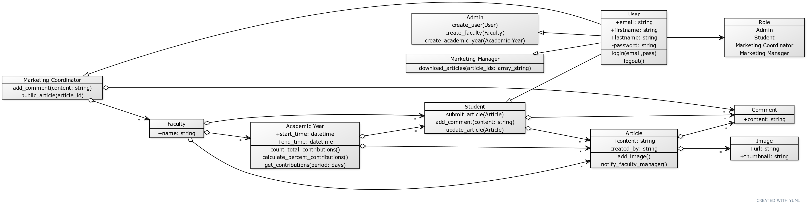

# enterprise-web

# **User**
### **Fields**
1. **email**: string
2. **firstname**: string
3. **lastname**: string
4. **password**: string
5. **role**: enum (Admin | Student | Marketing Coordinator | Marketing Manager)

### **Functions**
1. **login**(email: string, pass: string)
2. **logout**()

# **Admin**
> 1. An administrator maintains any system data, e.g. closure dates for each academic year.

### **Functions**
1. CRUD (User | Faculty | Academic Year)

# **Student**
> 1. All students have the opportunity to submit one or more articles as Word documents to the magazine.
> 
> 2. All students can also upload high quality images, e.g. photographs. 
>
> 3. All new contributions are disabled after a closure date for new entries, but updates can continue to be done until a final closure date.
> 
> 4. All students must agree to Terms and Conditions before they can submit.

### **Functions**
1. **submit_article**(Article)
2. **add_comment**(article_id: string, content: string)
3. **update_article**(Article)

# **Marketing Coordinator**
> 1. Once a contribution is submitted the system emails a notification to the Faculty’s Marketing Coordinator, who must make a comment within 14 days.
> 
> 2. A Marketing Coordinator can only access contributions by students in their Faculty.
> 
> 3. Each Marketing Coordinator needs to be able to interact with the students in their Faculty in order to edit the contributions and to select those for publication.
### **Fields**
1. **faculties**: array Faculty
### **Functions**
1. **add_comment**(article_id: string, content: string)
2. **public_article**(article_id)

# **Marketing Manager**
> 1. The University Marketing Manager can view all the selected contributions but cannot edit any.  They need to be able to download all the selected contributions after the final closure date in a ZIP file for transfer out of the system.

### **Functions**
1. **download_articles**(article_ids: array_string)

# **Faculty**
### **Fields**
1. **name**: string
2. **years**: array Academic Year
3. **students**: array Student
4. **coordinator**: Marketing Coordinator

# **Academic Year**
### **Fields**
1. **name**: string
2. **start_time**: datetime
3. **end_time**: datetime
### **Functions**
1. **count_total_contributions**()
2. **calculate_percent_contributions**()
3. **get_contributions**(period: number)

***
> University have multi Faculties and each Faculty have multi Academic Year. To submit a new article, student have to select Faculty and Academic Year
***

# **Article**
### **Fields**
1. **content**: string
2. **created_by**: string
3. **images**: array Image
4. **comments**: array Comment
### **Functions**
2. **notify_faculty_manager**(faculty_id: string)

# **Comment**
### **Fields**
1. **content**: string

# **Image**
### **Fields**
1. **base_url**: string
2. **thumbnail_url**: string